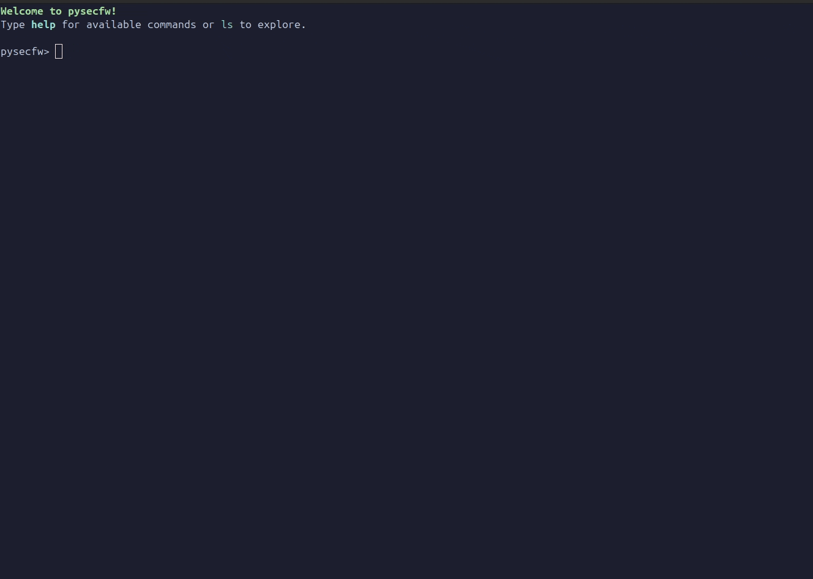

import { Card, CardGrid } from '@astrojs/starlight/components';

## Live Demo



---

## Quick Start Guides

<CardGrid>
  <Card title="Installation & Setup" icon="rocket">
    Get pysecfw running in minutes with uv.
    
    **Time:** 2 minutes  
    [Install Now →](/pysecfw/introduction/installation/)
  </Card>
  <Card title="5-Minute Quickstart" icon="document">
    Run your first exploit and understand core concepts.
    
    **Time:** 5 minutes  
    [Start Tutorial →](/pysecfw/introduction/quick-start/)
  </Card>
</CardGrid>

---

## Choose Your Workflow

<CardGrid>

  <Card title="Interactive Hunter" icon="open-book">
    **Metasploit-like shell experience**
    
    ```bash
    pysecfw
    pysecfw> ls cve
    pysecfw> use cve.cve_XXXX_XXXX
    pysecfw> set RHOST target
    pysecfw> set RPORT 80
    pysecfw> run
    ```
    
    Perfect for: Live engagements, exploration, learning
  </Card>

  <Card title="CLI Power User" icon="rocket">
    **One-liners for rapid testing**
    
    ```bash
    pysecfw run CVE-XXXX-XXXX \
      --set RHOST=target.com \
      --set RPORT=80
    ```
    
    Perfect for: Automation, scripting, CI/CD pipelines
  </Card>
</CardGrid>

---

## Community & Support

- **[GitHub Repository](https://github.com/ajutamangdev/pysecfw)** - Source code, issues, discussions
- **[Issue Tracker](https://github.com/ajutamangdev/pysecfw/issues)** - Report bugs, request features
- **[Discussions](https://github.com/ajutamangdev/pysecfw/discussions)** - Ask questions, share knowledge
- **[Contributing Guide](/pysecfw/contribution/guidelines/)** - How to add modules and improve pysecfw

---

